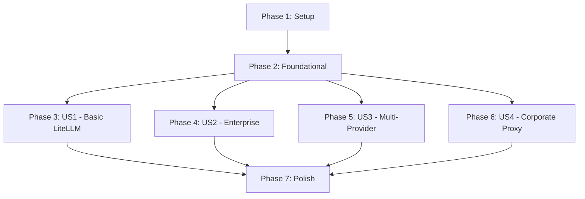

# Tasks: LLM Gateway Configuration Assistant with Vertex AI Model Garden

**Input**: Design documents from `/specs/001-llm-gateway-config/`
**Prerequisites**: plan.md ✅, spec.md ✅, research.md ✅, data-model.md ✅, contracts/ ✅, quickstart.md ✅

**Project Type**: Documentation/Configuration (no code changes to Claude Code core)
**Implementation Approach**: Create configuration templates, test scripts, and documentation

**Organization**: Tasks are grouped by user story to enable independent implementation and testing.

## Format: `- [ ] [ID] [P?] [Story?] Description with file path`

- **[P]**: Can run in parallel (different files, no dependencies)
- **[Story]**: User story label (US1, US2, US3, US4) - only for story-specific tasks
- Include exact file paths in descriptions

## Path Conventions

All artifacts go in `/specs/001-llm-gateway-config/` - no changes to Claude Code repository root.

---

## Phase 1: Setup (Project Initialization)

**Purpose**: Create project structure for documentation, templates, and scripts

- [x] T001 Create templates directory structure in specs/001-llm-gateway-config/templates/
- [x] T002 [P] Create scripts directory structure in specs/001-llm-gateway-config/scripts/
- [x] T003 [P] Create examples directory structure in specs/001-llm-gateway-config/examples/
- [x] T004 [P] Create tests directory structure in specs/001-llm-gateway-config/tests/

**Checkpoint**: Directory structure ready for template and script creation

---

## Phase 2: Foundational (Blocking Prerequisites)

**Purpose**: Core configuration templates and validation scripts that ALL user stories depend on

**⚠️ CRITICAL**: No user story work can begin until this phase is complete

- [x] T005 Create base LiteLLM configuration template (minimal) in templates/litellm-base.yaml
- [x] T006 [P] Create environment variables reference template in templates/env-vars-reference.md
- [x] T007 [P] Create settings.json schema template in templates/settings-schema.json
- [x] T008 Create configuration validation script in scripts/validate-config.py
- [x] T009 [P] Create health check verification script in scripts/health-check.sh
- [x] T010 [P] Create status check helper script in scripts/check-status.sh
- [x] T011 Create common troubleshooting functions in scripts/troubleshooting-utils.sh
- [x] T012 [P] Create prerequisite checker script in scripts/check-prerequisites.sh
- [x] T013 Document deployment pattern decision tree in templates/deployment-patterns.md

**Checkpoint**: Foundation ready - user story implementation can now begin in parallel

---

## Phase 3: User Story 1 - Basic LiteLLM Gateway Setup (Priority: P1) 🎯 MVP

**Goal**: Enable developers to configure Claude Code with local LiteLLM proxy for 8 Vertex AI models with basic usage tracking

**Independent Test**: Start local LiteLLM instance, configure Claude Code env vars, run `claude /status` to verify gateway connection, execute command to test routing

**Prerequisite**: Intermediate developer with 1+ years experience (see spec.md §Prerequisite Knowledge - YAML, environment variables, CLI basics, HTTP/HTTPS protocols)

### Configuration Templates for User Story 1

- [x] T014 [P] [US1] Create Gemini 2.5 Flash model config in templates/models/gemini-2.5-flash.yaml
- [x] T015 [P] [US1] Create Gemini 2.5 Pro model config in templates/models/gemini-2.5-pro.yaml
- [x] T016 [P] [US1] Create DeepSeek R1 model config in templates/models/deepseek-r1.yaml
- [x] T017 [P] [US1] Create Llama3 405B model config in templates/models/llama3-405b.yaml
- [x] T018 [P] [US1] Create Codestral model config in templates/models/codestral.yaml
- [x] T019 [P] [US1] Create Qwen3 Coder 480B model config in templates/models/qwen3-coder-480b.yaml
- [x] T020 [P] [US1] Create Qwen3 235B model config in templates/models/qwen3-235b.yaml
- [x] T021 [P] [US1] Create GPT-OSS 20B model config in templates/models/gpt-oss-20b.yaml
- [x] T022 [US1] Create complete LiteLLM proxy config with all 8 models in templates/litellm-complete.yaml
- [x] T023 [US1] Create Claude Code environment variables setup guide in examples/us1-env-vars-setup.md

### Scripts for User Story 1

- [x] T024 [P] [US1] Create LiteLLM startup script in scripts/start-litellm-proxy.sh
- [x] T025 [P] [US1] Create model availability checker in scripts/check-model-availability.py
- [x] T026 [US1] Create end-to-end test script for all 8 models in tests/test-all-models.py
- [x] T027 [US1] Create usage logging verification script in tests/verify-usage-logging.sh

### Documentation for User Story 1

- [x] T028 [US1] Create step-by-step setup guide (10-15 min target) in examples/us1-quickstart-basic.md
- [x] T029 [US1] Document gcloud auth setup procedure in examples/us1-gcloud-auth.md
- [x] T030 [US1] Document troubleshooting for common setup issues in examples/us1-troubleshooting.md
- [x] T031 [US1] Create verification checklist in examples/us1-verification-checklist.md

**Checkpoint**: User Story 1 complete - developers can set up local LiteLLM gateway independently

---

## Phase 4: User Story 2 - Enterprise Gateway Integration (Priority: P2)

**Goal**: Enable enterprise architects to integrate Claude Code with existing enterprise gateways (TrueFoundry, Zuplo, custom) with authentication and compliance requirements

**Independent Test**: Configure Claude Code with enterprise gateway endpoint, verify custom headers forwarded, confirm rate limiting enforcement works

### Configuration Templates for User Story 2

- [x] T032 [P] [US2] Create TrueFoundry gateway config template in templates/enterprise/truefoundry-config.yaml
- [x] T033 [P] [US2] Create Zuplo gateway config template in templates/enterprise/zuplo-config.yaml
- [x] T034 [P] [US2] Create custom enterprise gateway config template in templates/enterprise/custom-gateway-config.yaml
- [x] T035 [US2] Create header forwarding configuration guide in templates/enterprise/header-forwarding.md
- [x] T036 [US2] Create authentication token setup template in templates/enterprise/auth-token-setup.md

### Scripts for User Story 2

- [x] T037 [P] [US2] Create gateway compatibility validator in scripts/validate-gateway-compatibility.py
- [x] T038 [P] [US2] Create header verification test script in tests/test-header-forwarding.sh
- [x] T039 [US2] Create rate limiting verification script in tests/test-rate-limiting.py
- [x] T040 [US2] Create authentication troubleshooting helper in scripts/debug-auth.sh

### Documentation for User Story 2

- [x] T041 [US2] Create enterprise integration guide in examples/us2-enterprise-integration.md
- [x] T042 [US2] Document security best practices for enterprise deployments in examples/us2-security-best-practices.md
- [x] T043 [US2] Create gateway compatibility criteria checklist in examples/us2-compatibility-checklist.md
- [x] T044 [US2] Document compliance considerations (SOC2, HIPAA) in examples/us2-compliance-guide.md
- [x] T045 [US2] Create third-party gateway warning template in templates/enterprise/third-party-warning.md

**Checkpoint**: User Story 2 complete - enterprise architects can integrate with existing gateways independently

---

## Phase 5: User Story 3 - Multi-Provider Gateway Configuration (Priority: P3)

**Goal**: Enable platform engineers to configure Claude Code with gateways supporting multiple providers (Anthropic, Bedrock, Vertex AI) with provider-specific environment variables

**Independent Test**: Configure gateway with multiple providers, set provider-specific base URLs and auth bypass flags, verify routing to each provider works correctly

### Configuration Templates for User Story 3

- [x] T046 [P] [US3] Create multi-provider LiteLLM config template in templates/multi-provider/multi-provider-config.yaml
- [x] T047 [P] [US3] Create Bedrock provider config template in templates/multi-provider/bedrock-config.yaml
- [x] T048 [P] [US3] Create Vertex AI provider config template in templates/multi-provider/vertex-ai-config.yaml
- [x] T049 [P] [US3] Create Anthropic direct provider config template in templates/multi-provider/anthropic-config.yaml
- [x] T050 [US3] Create provider routing strategy guide in templates/multi-provider/routing-strategies.md

### Scripts for User Story 3

- [x] T051 [P] [US3] Create provider-specific env vars validator in scripts/validate-provider-env-vars.py
- [x] T052 [P] [US3] Create authentication bypass verification script in tests/test-auth-bypass.sh
- [x] T053 [US3] Create multi-provider routing test in tests/test-multi-provider-routing.py
- [x] T054 [US3] Create provider fallback verification script in tests/test-provider-fallback.py

### Documentation for User Story 3

- [x] T055 [US3] Create multi-provider setup guide in examples/us3-multi-provider-setup.md
- [x] T056 [US3] Document provider-specific environment variables in examples/us3-provider-env-vars.md
- [x] T057 [US3] Create cost optimization guide for multi-provider scenarios in examples/us3-cost-optimization.md
- [x] T058 [US3] Document provider selection decision tree in examples/us3-provider-selection.md
- [x] T059 [US3] Create authentication bypass use cases guide in examples/us3-auth-bypass-guide.md

**Checkpoint**: User Story 3 complete - platform engineers can configure multi-provider gateways independently

---

## Phase 6: User Story 4 - Corporate Proxy Configuration (Priority: P4)

**Goal**: Enable developers behind corporate proxies to configure Claude Code to route through HTTP/HTTPS proxy while also using LLM gateway

**Independent Test**: Set HTTPS_PROXY env var, configure gateway, verify requests traverse corporate proxy to gateway to provider

### Configuration Templates for User Story 4

- [x] T060 [P] [US4] Create proxy + gateway config template in templates/proxy/proxy-gateway-config.yaml
- [x] T061 [P] [US4] Create proxy-only config template in templates/proxy/proxy-only-config.yaml
- [x] T062 [US4] Create proxy authentication guide in templates/proxy/proxy-auth.md
- [x] T063 [US4] Create proxy troubleshooting flowchart in templates/proxy/proxy-troubleshooting-flowchart.md

### Scripts for User Story 4

- [x] T064 [P] [US4] Create proxy connectivity checker in scripts/check-proxy-connectivity.sh
- [x] T065 [P] [US4] Create proxy authentication validator in scripts/validate-proxy-auth.py
- [x] T066 [US4] Create proxy + gateway integration test in tests/test-proxy-gateway.py
- [x] T067 [US4] Create proxy bypass verification script in tests/test-proxy-bypass.sh

### Documentation for User Story 4

- [x] T068 [US4] Create corporate proxy setup guide in examples/us4-corporate-proxy-setup.md
- [x] T069 [US4] Document HTTPS_PROXY configuration in examples/us4-https-proxy-config.md
- [x] T070 [US4] Create proxy + gateway architecture diagram in examples/us4-proxy-gateway-architecture.md
- [x] T071 [US4] Document common proxy issues and solutions in examples/us4-proxy-troubleshooting.md
- [x] T072 [US4] Create proxy firewall bypass considerations in examples/us4-firewall-considerations.md

**Checkpoint**: All user stories complete - full gateway configuration coverage achieved

---

## Phase 7: Polish & Cross-Cutting Concerns

**Purpose**: Documentation, validation, and improvements affecting multiple user stories

### Comprehensive Documentation

- [x] T073 [P] Create master configuration reference guide in docs/configuration-reference.md
- [x] T074 [P] Create deployment patterns comparison matrix in docs/deployment-patterns-comparison.md
- [x] T075 [P] Create environment variables complete reference in docs/environment-variables.md
- [x] T076 [P] Create security best practices consolidated guide in docs/security-best-practices.md
- [x] T077 [P] Create troubleshooting master guide in docs/troubleshooting-guide.md
- [x] T078 [P] Create FAQ document addressing common questions in docs/faq.md

### Integration & Validation

- [x] T079 Create master validation script that runs all checks in scripts/validate-all.sh
- [x] T080 Create configuration migration helper script in scripts/migrate-config.py
- [x] T081 Create configuration rollback utility in scripts/rollback-config.sh
- [x] T082 Update quickstart.md with links to all user story examples
- [x] T083 Create README.md for specs/001-llm-gateway-config/ with navigation

### Testing & Quality Assurance

- [x] T084 [P] Create integration test suite runner in tests/run-all-tests.sh
- [x] T085 [P] Add YAML schema validation tests in tests/test-yaml-schemas.py
- [x] T086 [P] Add environment variable validation tests in tests/test-env-vars.py
- [x] T087 Create configuration examples validation script in tests/validate-examples.sh
- [x] T088 Run all user story verification checklists (US1-US4)

### Advanced Features Documentation

- [ ] T089 [P] Document load balancing strategies in docs/load-balancing.md
- [ ] T090 [P] Document fallback and retry policies in docs/fallback-retry.md
- [ ] T091 [P] Document multi-region deployment in docs/multi-region-deployment.md
- [ ] T092 [P] Document observability and monitoring in docs/observability.md
- [ ] T093 [P] Document cost tracking and optimization in docs/cost-tracking.md
- [ ] T094 [P] Document credential rotation procedures in docs/credential-rotation.md

### Repository Integration

- [ ] T095 Create CHANGELOG entry for this feature
- [ ] T096 Update main README.md with link to gateway configuration docs
- [ ] T097 Create example configurations for CI/CD environments in examples/ci-cd/
- [ ] T098 Create Docker Compose example for local development in examples/docker/

**Checkpoint**: All polish and cross-cutting concerns complete - feature ready for production use

---

## Dependencies & Execution Order

### Phase Dependencies



- **Setup (Phase 1)**: No dependencies - can start immediately
- **Foundational (Phase 2)**: Depends on Setup - BLOCKS all user stories
- **User Stories (Phases 3-6)**: All depend on Foundational phase completion
  - **US1 (Phase 3)**: Can start after Phase 2 - MVP target
  - **US2 (Phase 4)**: Can start after Phase 2 - Independent from US1
  - **US3 (Phase 5)**: Can start after Phase 2 - Independent from US1, US2
  - **US4 (Phase 6)**: Can start after Phase 2 - Independent from US1-US3
- **Polish (Phase 7)**: Depends on all user stories you want to complete

### User Story Dependencies

- **User Story 1 (P1) - Basic LiteLLM Setup**:

  - No dependencies on other stories
  - Recommended MVP scope
  - Templates: 8 model configs + complete proxy config
  - Scripts: 4 scripts
  - Docs: 4 guides

- **User Story 2 (P2) - Enterprise Gateway**:

  - Independent from US1
  - Can use foundational validation scripts
  - Templates: 5 enterprise configs
  - Scripts: 4 scripts
  - Docs: 5 guides

- **User Story 3 (P3) - Multi-Provider**:

  - Independent from US1, US2
  - May reference routing concepts from US1
  - Templates: 5 provider configs
  - Scripts: 4 scripts
  - Docs: 5 guides

- **User Story 4 (P4) - Corporate Proxy**:
  - Independent from US1-US3
  - Combines well with any other story
  - Templates: 4 proxy configs
  - Scripts: 4 scripts
  - Docs: 5 guides

### Within Each User Story

**Recommended Order**:

1. Configuration templates FIRST (enables testing during creation)
2. Scripts in parallel with templates (can test templates immediately)
3. Documentation LAST (captures lessons learned during implementation)

### Parallel Opportunities

#### Phase 1: Setup

- All 4 directory creation tasks can run in parallel

#### Phase 2: Foundational

- T006, T007, T009, T010, T012 can all run in parallel
- T005, T008 should complete before T013

#### Phase 3: User Story 1

- **Templates**: T014-T021 (all 8 model configs) can run in parallel
- **Scripts**: T024, T025, T026, T027 can run in parallel after templates
- **Docs**: T028-T031 can run in parallel after scripts

#### Phase 4: User Story 2

- **Templates**: T032-T034 can run in parallel
- **Scripts**: T037, T038 can run in parallel
- **Docs**: T041-T044 can run in parallel

#### Phase 5: User Story 3

- **Templates**: T046-T049 can run in parallel
- **Scripts**: T051, T052 can run in parallel
- **Docs**: T055-T059 can run in parallel

#### Phase 6: User Story 4

- **Templates**: T060, T061 can run in parallel
- **Scripts**: T064, T065 can run in parallel
- **Docs**: T068-T072 can run in parallel

#### Phase 7: Polish

- **Docs**: T073-T078 can all run in parallel
- **Tests**: T084-T086 can run in parallel
- **Advanced Docs**: T089-T094 can all run in parallel

### Critical Path (Minimum for MVP)

To deliver **User Story 1 (Basic LiteLLM Setup)** as MVP:

1. Phase 1: Setup (4 tasks) - ~30 min
2. Phase 2: Foundational (9 tasks) - ~4 hours
3. Phase 3: US1 (18 tasks) - ~8 hours
4. Selected Polish tasks:
   - T082: Update quickstart.md
   - T083: Create README.md
   - T088: Run US1 verification

**Total MVP Effort**: ~13-15 hours of focused work

---

## Parallel Execution Examples

### Example 1: Full Team (4 developers)

**Week 1: Foundation**

- Dev A: Phase 1 + T005, T008, T013 (foundational configs)
- Dev B: T006, T007 (templates)
- Dev C: T009, T010, T011 (scripts)
- Dev D: T012 (prerequisites checker)

**Week 2: All User Stories in Parallel**

- Dev A: User Story 1 (Basic LiteLLM) - 18 tasks
- Dev B: User Story 2 (Enterprise) - 14 tasks
- Dev C: User Story 3 (Multi-Provider) - 14 tasks
- Dev D: User Story 4 (Corporate Proxy) - 13 tasks

**Week 3: Polish**

- All devs: Phase 7 tasks in parallel (15 tasks)

**Timeline**: 3 weeks with 4 developers

---

### Example 2: Solo Developer (MVP-focused)

**Day 1-2: Foundation**

- Complete Phase 1: Setup
- Complete Phase 2: Foundational

**Day 3-5: User Story 1 Only (MVP)**

- T014-T021: Model configs (prioritize Gemini models first)
- T022-T023: Complete proxy config + env vars
- T024-T027: Essential scripts
- T028-T031: Core documentation

**Day 6: Testing & Polish**

- T082, T083: Documentation updates
- T088: US1 verification
- T084: Basic testing

**Timeline**: 1 week solo for MVP (US1 only)

---

### Example 3: Two Developers (Balanced Approach)

**Sprint 1 (Week 1): Foundation + US1**

- Dev A: Phase 1 + Phase 2 foundational
- Dev B: Phase 2 scripts
- Both: User Story 1 in parallel (split templates vs scripts)

**Sprint 2 (Week 2): US2 + US3**

- Dev A: User Story 2 (Enterprise)
- Dev B: User Story 3 (Multi-Provider)

**Sprint 3 (Week 3): US4 + Polish**

- Dev A: User Story 4 (Corporate Proxy)
- Dev B: Phase 7 polish tasks
- Both: Final validation and testing

**Timeline**: 3 weeks with 2 developers

---

## Implementation Strategy

### MVP-First Approach (Recommended)

**MVP = User Story 1 Only**

Delivers immediate value:

- ✅ 8 Vertex AI models configured
- ✅ Local development setup working
- ✅ Basic usage tracking functional
- ✅ Verification procedures in place

**Then iterate**:

- P2: Add enterprise gateway support (US2)
- P3: Add multi-provider support (US3)
- P4: Add corporate proxy support (US4)

### Incremental Delivery

Each user story is independently deliverable:

- Ship US1 → Users can start using local LiteLLM
- Ship US2 → Enterprise customers can integrate
- Ship US3 → Advanced users get multi-provider
- Ship US4 → Corporate users get proxy support

### Testing Strategy

**Per User Story**:

1. Create templates
2. Write validation scripts
3. Test templates with scripts
4. Document findings
5. Run verification checklist
6. Mark story complete

**No tests requested in spec** - Focus on:

- Configuration validation
- Health checks
- End-to-end verification scripts
- Manual testing checklists

---

## Success Criteria Mapping

**SC-001** (Setup <10 min):

- Addressed by: T028 (US1 quickstart guide)
- Validation: T088 (run verification checklist)

**SC-002** (90% first-attempt success):

- Addressed by: T008 (validation script), T031 (verification checklist)
- Validation: T084 (integration test suite)

**SC-003** (Templates work without modification):

- Addressed by: All template tasks (T014-T021, etc.)
- Validation: T085 (YAML schema validation)

**SC-004** (Deployment pattern clarity <3 sentences):

- Addressed by: T013 (deployment patterns doc), T074 (patterns comparison)
- Validation: Manual review

**SC-005** (All required env vars included):

- Addressed by: T006 (env vars reference), T075 (env vars complete reference)
- Validation: T086 (env vars validation tests)

**SC-006** (100% security warnings):

- Addressed by: T042 (security best practices), T076 (consolidated security guide)
- Validation: Grep test in documentation

**SC-007** (Gateway compatibility validation):

- Addressed by: T037 (compatibility validator), T043 (compatibility checklist)
- Validation: T037 script execution

**SC-008** (80% issue resolution):

- Addressed by: T077 (troubleshooting master guide), T011 (troubleshooting utils)
- Validation: Issue tracking analysis

---

## File Structure (Final State)

```
specs/001-llm-gateway-config/
├── plan.md ✅
├── spec.md ✅
├── research.md ✅
├── data-model.md ✅
├── quickstart.md ✅
├── checklists/
│   ├── requirements.md ✅
│   └── implementation-readiness.md ✅
├── contracts/
│   └── assistant-api.md ✅
├── templates/
│   ├── litellm-base.yaml (T005)
│   ├── litellm-complete.yaml (T022)
│   ├── env-vars-reference.md (T006)
│   ├── settings-schema.json (T007)
│   ├── deployment-patterns.md (T013)
│   ├── models/
│   │   ├── gemini-2.5-flash.yaml (T014)
│   │   ├── gemini-2.5-pro.yaml (T015)
│   │   ├── deepseek-r1.yaml (T016)
│   │   ├── llama3-405b.yaml (T017)
│   │   ├── codestral.yaml (T018)
│   │   ├── qwen3-coder-480b.yaml (T019)
│   │   ├── qwen3-235b.yaml (T020)
│   │   └── gpt-oss-20b.yaml (T021)
│   ├── enterprise/
│   │   ├── truefoundry-config.yaml (T032)
│   │   ├── zuplo-config.yaml (T033)
│   │   ├── custom-gateway-config.yaml (T034)
│   │   ├── header-forwarding.md (T035)
│   │   ├── auth-token-setup.md (T036)
│   │   └── third-party-warning.md (T045)
│   ├── multi-provider/
│   │   ├── multi-provider-config.yaml (T046)
│   │   ├── bedrock-config.yaml (T047)
│   │   ├── vertex-ai-config.yaml (T048)
│   │   ├── anthropic-config.yaml (T049)
│   │   └── routing-strategies.md (T050)
│   └── proxy/
│       ├── proxy-gateway-config.yaml (T060)
│       ├── proxy-only-config.yaml (T061)
│       ├── proxy-auth.md (T062)
│       └── proxy-troubleshooting-flowchart.md (T063)
├── scripts/
│   ├── validate-config.py (T008)
│   ├── health-check.sh (T009)
│   ├── check-status.sh (T010)
│   ├── troubleshooting-utils.sh (T011)
│   ├── check-prerequisites.sh (T012)
│   ├── start-litellm-proxy.sh (T024)
│   ├── check-model-availability.py (T025)
│   ├── validate-gateway-compatibility.py (T037)
│   ├── debug-auth.sh (T040)
│   ├── validate-provider-env-vars.py (T051)
│   ├── check-proxy-connectivity.sh (T064)
│   ├── validate-proxy-auth.py (T065)
│   ├── validate-all.sh (T079)
│   ├── migrate-config.py (T080)
│   └── rollback-config.sh (T081)
├── tests/
│   ├── test-all-models.py (T026)
│   ├── verify-usage-logging.sh (T027)
│   ├── test-header-forwarding.sh (T038)
│   ├── test-rate-limiting.py (T039)
│   ├── test-auth-bypass.sh (T052)
│   ├── test-multi-provider-routing.py (T053)
│   ├── test-provider-fallback.py (T054)
│   ├── test-proxy-gateway.py (T066)
│   ├── test-proxy-bypass.sh (T067)
│   ├── run-all-tests.sh (T084)
│   ├── test-yaml-schemas.py (T085)
│   ├── test-env-vars.py (T086)
│   └── validate-examples.sh (T087)
├── examples/
│   ├── us1-env-vars-setup.md (T023)
│   ├── us1-quickstart-basic.md (T028)
│   ├── us1-gcloud-auth.md (T029)
│   ├── us1-troubleshooting.md (T030)
│   ├── us1-verification-checklist.md (T031)
│   ├── us2-enterprise-integration.md (T041)
│   ├── us2-security-best-practices.md (T042)
│   ├── us2-compatibility-checklist.md (T043)
│   ├── us2-compliance-guide.md (T044)
│   ├── us3-multi-provider-setup.md (T055)
│   ├── us3-provider-env-vars.md (T056)
│   ├── us3-cost-optimization.md (T057)
│   ├── us3-provider-selection.md (T058)
│   ├── us3-auth-bypass-guide.md (T059)
│   ├── us4-corporate-proxy-setup.md (T068)
│   ├── us4-https-proxy-config.md (T069)
│   ├── us4-proxy-gateway-architecture.md (T070)
│   ├── us4-proxy-troubleshooting.md (T071)
│   ├── us4-firewall-considerations.md (T072)
│   ├── ci-cd/ (T097)
│   └── docker/ (T098)
├── docs/
│   ├── configuration-reference.md (T073)
│   ├── deployment-patterns-comparison.md (T074)
│   ├── environment-variables.md (T075)
│   ├── security-best-practices.md (T076)
│   ├── troubleshooting-guide.md (T077)
│   ├── faq.md (T078)
│   ├── load-balancing.md (T089)
│   ├── fallback-retry.md (T090)
│   ├── multi-region-deployment.md (T091)
│   ├── observability.md (T092)
│   ├── cost-tracking.md (T093)
│   └── credential-rotation.md (T094)
├── README.md (T083)
├── CHANGELOG.md (T095)
└── tasks.md (this file)
```

---

**Total Tasks**: 98
**MVP Tasks (US1 only)**: 31 (Phase 1-3 + selected polish)
**Parallel Opportunities**: 40+ tasks can run in parallel within their phases
**Estimated MVP Timeline**: 1-2 weeks (solo developer), 3-5 days (team of 3-4)

**Ready to implement!** 🚀
